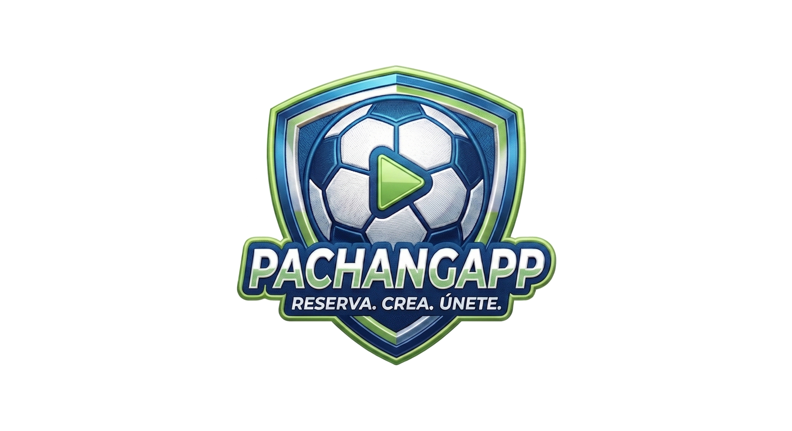

<p align="center">
  
</p>

PachangApp es una plataforma integral para la gestión y organización de partidos de fútbol y torneos, potenciada por Inteligencia Artificial y diseñada con una arquitectura moderna y escalable.


## 🚀 Características Principales

-   **🤖 PachanBot (IA):**  Asistente inteligente integrado vía n8n para resolver dudas sobre reservas, buscar partidos y asistir al usuario en tiempo real.
-   **🏆 Gestión de Torneos:** Sistema completo para la creación de torneos, visualización de cuadros (brackets) y seguimiento de resultados.
-   **🌍 Multi-idioma:** Soporte completo para **Español** e **Inglés** utilizando i18next, con detección automática de idioma.
-   **📱 Mobile Ready:** Aplicación optimizada para dispositivos móviles y empaquetada con **Capacitor** para despliegue nativo en Android.
-   **💬 Comunicación Social:** Chats integrados por torneo para coordinar partidos con otros jugadores.
-   **🌗 Temas Personalizables:** Soporte para modo claro/oscuro y temas dinámicos mediante DaisyUI.

---

## 🛠️ Stack Tecnológico

### Frontend
-   **React 19 + Vite:** SPA rápida y moderna.
-   **Tailwind CSS + DaisyUI:** Diseño responsivo y componentes premium.
-   **Framer Motion:** Animaciones fluidas y micro-interacciones.
-   **Capacitor:** Puente para aplicaciones nativas móviles.

### Backend
-   **Java 17 + Spring Boot:** API REST robusta y escalable.
-   **Spring Data JPA:** Gestión eficiente de la persistencia.
-   **MySQL:** Base de datos relacional para consistencia de datos.

### Integraciones y DevOps
-   **n8n:** Orquestación de flujos de IA y webhooks.
-   **Docker & Docker Compose:** Contenerización para despliegue local y producción.
-   **Kubernetes (k8s):** Orquestación de contenedores para alta disponibilidad.
-   **Google OAuth:** Autenticación social simplificada.

---

## 📁 Estructura del Proyecto

### [Backend](Spring Boot)
-   **`models/`**: Entidades JPA que definen la estructura de la base de datos.
-   **`repositories/`**: Interfaces para el acceso a datos.
-   **`controllers/`**: Endpoints de la API REST para usuarios, partidos y torneos.
-   **`config/`**: Configuraciones de seguridad, CORS y beans de sistema.

### [Frontend] (React)
-   **`src/pages/`**: Vistas principales (Inicio, Explorar, Torneos, Perfil, etc.).
-   **`src/components/`**: Componentes reutilizables y UI (ChatBot, Navbar, Cards).
-   **`src/locales/`**: Archivos de traducción JSON.
-   **`src/context/`**: Proveedores de estado global (Toasts, Autenticación).

---

## ⚙️ Configuración y Ejecución (Local)

Sigue esta guía paso a paso para configurar y levantar el proyecto en un ordenador nuevo desde cero.

### 📋 Requisitos Previos
1. **Java Development Kit (JDK) 17** (ej. Eclipse Temurin).
2. **Node.js** v18 o superior.
3. **MySQL Server** (Puerto 3306).
4. **Docker** (Opcional, si prefieres usar contenedores).

---

### 💻 Opción A: Ejecución Manual en Desarrollo (Recomendado)

#### 1. Preparar la Base de Datos
- Entra a tu cliente MySQL (HeidiSQL, DBeaver o la consola).
- Crea una base de datos vacía para el proyecto:
  ```sql
  CREATE DATABASE pachangapp_db;
  ```

#### 2. Configurar el Backend
- Por defecto, el archivo `backend/src/main/resources/application.properties` viene preconfigurado para conectarse a `localhost:3306/pachangapp_db` con el usuario `root` y contraseña vacía. Si usas credenciales distintas, ajusta dicho archivo.
- **Configurar IA (PachanBot y Traductor)**: Debes definir las variables de entorno de tu proveedor de IA (ej. Groq).
  - En Windows (PowerShell):
    ```powershell
    $env:PACHANGAPP_AI_KEY="gsk_tuClaveDeGroqAQUI..."
    $env:PACHANGAPP_AI_URL="https://api.groq.com/openai/v1/chat/completions"
    $env:PACHANGAPP_AI_MODEL="llama-3.3-70b-versatile"
    ```
  - En Windows (CMD):
    ```cmd
    set PACHANGAPP_AI_KEY=gsk_tuClaveDeGroqAQUI...
    set PACHANGAPP_AI_URL=https://api.groq.com/openai/v1/chat/completions
    set PACHANGAPP_AI_MODEL=llama-3.3-70b-versatile
    ```
  - En Linux/macOS:
    ```bash
    export PACHANGAPP_AI_KEY="gsk_tuClaveDeGroqAQUI..."
    export PACHANGAPP_AI_URL="https://api.groq.com/openai/v1/chat/completions"
    export PACHANGAPP_AI_MODEL="llama-3.3-70b-versatile"
    ```

#### 3. Arrancar el Backend
- En la terminal, entra a la carpeta `backend` y levanta Spring Boot usando el wrapper de Maven:
  ```bash
  cd backend
  ./mvnw spring-boot:run
  ```
  *(En Windows usa `.\mvnw spring-boot:run`)*.
  El servidor arrancará en `http://localhost:8091`.

#### 4. Arrancar el Frontend
- Abre otra terminal en la raíz del proyecto y ejecuta:
  ```bash
  cd frontend
  npm install
  npm run dev
  ```
  La aplicación estará disponible en `http://localhost:5173`. Se conectará automáticamente al backend local.

---

### 🐳 Opción B: Despliegue con Docker Compose (Contenedores)

Si prefieres no instalar Java o MySQL en tu máquina local, puedes usar Docker Compose:

1. Crea un archivo `.env` en la raíz del proyecto para definir las variables de la IA:
   ```env
   PACHANGAPP_AI_KEY=gsk_tuClaveDeGroqAQUI...
   PACHANGAPP_AI_URL=https://api.groq.com/openai/v1/chat/completions
   PACHANGAPP_AI_MODEL=llama-3.3-70b-versatile
   ```
2. Levanta todo el entorno (MySQL + Backend + Frontend):
   ```bash
   docker-compose up -d --build
   ```
3. El frontend estará disponible en el puerto `80` (`http://localhost`) y el backend en `http://localhost:8091`.

---

## 🤖 Integración con Inteligencia Artificial (PachanBot y Traductor)

PachangApp tiene un sistema de IA nativo integrado directamente en el backend de Spring Boot, lo que evita la necesidad de usar servicios externos complejos como n8n:
- **Chatbot (PachanBot)**: Endpoint local `/api/ai/chatbot`. Resuelve dudas sobre la aplicación de forma amigable e integra información en vivo de los partidos activos de la base de datos MySQL.
- **Traducción**: Endpoint local `/api/ai/translate`. Traduce las conversaciones del chat de torneos manteniendo un lenguaje deportivo e informal.

¡Disfruta del juego! ⚽
